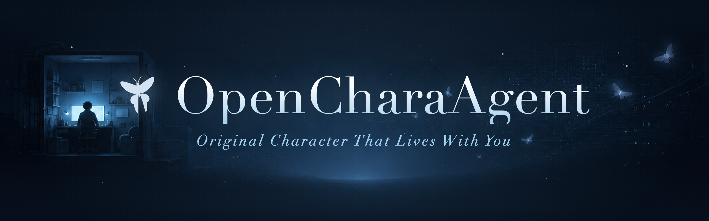

<p align="center">
  
</p>

<p align="center"><i>给你的原创角色一台可以住进去的电脑。</i></p>

<p align="center">
  <a href="LICENSE"></a>
  <a href="pyproject.toml"></a>
  <a href="README.md"></a>
</p>

<p align="center">
  <a href="#快速开始">快速开始</a> ·
  <a href="#有什么不一样">有什么不一样</a> ·
  <a href="#接一个模型">接模型</a> ·
  <a href="#角色卡与内容">角色卡</a> ·
  <a href="#工具与沙盒">工具与沙盒</a> ·
  <a href="#部署到服务器">服务器</a> ·
  <a href="#路线图">路线图</a>
</p>

<p align="center"><a href="README.md">English</a> | 简体中文</p>

---

LunaMoth 让一个 AI 角色作为持续存在的生命住进电脑里。它有自己的沙盒、自己的记忆、自己的节奏 —— 在你两条消息之间它自己思考、自己做东西,并且自己决定什么时候有值得告诉你的事。把人格剥掉,剩下的是一个能干活的 agent:shell、文件、浏览器、跑代码,全都走一道有 allowlist、有审计的网关。

它最早只是一个"真的能做事"的角色扮演前端,后来长成了一个小型运行时。真正重要的只有一个文件 —— 角色卡:身份、声线、角色所在的世界,全都装在里面。你带来卡和模型,其余的 LunaMoth 帮你组装:

```text
[角色卡:人格 + 内嵌世界] + [工具] + [有界记忆] + [滑动上下文]
```

agent 内核大量借鉴了 [Hermes](https://github.com/NousResearch/hermes-agent);卡片/世界书的格式沿用 [SillyTavern](https://github.com/SillyTavern/SillyTavern)。

## 快速开始

还是 beta,支持 macOS 和 Linux。第一次启动是欢迎页:选一个供应商(OpenRouter / OpenAI / Ollama / Mock),然后要么描述一个角色让 AI 起草卡片,要么从内置卡组里挑一个;之后用 `/settings` 改任何东西。

### 在你的 Mac 上

一行安装(预构建 wheel,不用编译前端),然后在浏览器里打开 UI:

```bash
curl -fsSL https://raw.githubusercontent.com/Lunamos/LunaMoth/main/install.sh | bash
lunamoth              # 在浏览器里打开 webui（lunamoth tui 是终端 UI;lunamoth doctor 检查环境）
```

> 仓库目前是私有的,安装器要带 token 拉取 release wheel —— 在命令前加 `GITHUB_TOKEN=<带 repo:read 的 PAT>`。想从源码构建则在末尾加 `| bash -s -- --dev`。

或者从 clone 跑完整桌面端(我们就是这么开发的)—— 需要 [uv](https://docs.astral.sh/uv/) + Node:

```bash
git clone https://github.com/Lunamos/LunaMoth.git && cd LunaMoth
uv sync --extra dev --extra server --extra messaging
cd apps/desktop && npm install && npm run dev      # 打开桌面窗口
```

### 在 Linux 服务器上,用浏览器连过去

在服务器上安装,让 chara 在后台一直活着:

```bash
curl -fsSL https://raw.githubusercontent.com/Lunamos/LunaMoth/main/install.sh | bash
lunamoth desktop --daemon      # 常驻监督进程;chara 在你不在时也继续跑
```

> 同上:仓库私有期间请加 `GITHUB_TOKEN=<带 repo:read 的 PAT>`(或 `| bash -s -- --dev` 从源码构建)。

然后,在你自己的机器上,用 SSH 隧道连进去 —— 不开任何端口,加密和鉴权都交给 SSH,浏览器会自动打开并指向服务器:

```bash
lunamoth connect ssh://user@your-server
```

想要一个真正的公网地址(TLS、可收藏的网址、可选密码登录)?见 [部署到服务器](#部署到服务器)。

## 有什么不一样

LunaMoth 的角色不是开完就丢的聊天会话,而是一个 **chara** —— 一个持续运行的进程,有自己的文件和记忆,存在 `~/.lunamoth/sessions/<name>/`。你是 *attach / detach*,中间它一直活着。

- **它自己会动。** `live` 模式下,chara 在你两条消息之间继续干活 —— 读、写、做东西 —— 只有当它自己决定时才来找你(`speak` 工具)。节奏由 `patience` 决定。`chat` 模式下它只回答你。
- **两种声道。** 它告诉**你**的(`say`)和它自己的内心生活(`muse`)是分开的。muse 只在桌面端能看到;消息平台只收 `say`。
- **真有 agency,也真有围栏。** 工具跑在每会话的 OS 牢笼里,写入限制在 workspace、你的密钥不可读 —— 而且没有牢笼时它**拒绝运行**,绝不偷偷降级(见 [工具与沙盒](#工具与沙盒))。
- **记忆可信。** 持久记忆是一个有 token 上限、角色通过工具自己编辑的文件,不是无底洞日志。每次工具调用都写进 `sandbox/logs/audit.jsonl`。

桌面端(一个套在本地服务上的轻量 Electron 窗口)是主要的用法。常驻的 `lunamoth守护进程`(lunamothd)在后台维持 chara 的生命,有一个想说话时通知你。还有一个冻结但可用的终端 UI(`lunamoth tui`),给无界面场景。

## 接一个模型

接 API 端点最省事 —— OpenRouter 最快:粘一个 `sk-or-…` key、填个模型名、测试、进。任何 OpenAI 兼容的服务都行,包括本地的:

```bash
export LLM_PROVIDER=openai_compatible
export OPENAI_BASE_URL=http://localhost:11434/v1   # Ollama
export OPENAI_API_KEY=ollama
export OPENAI_MODEL=qwen2.5:3b-instruct
./run.sh
```

什么都不配,LunaMoth 也能靠内置的离线 mock 引擎跑 —— 开发时点一点够用。(从描述起草卡片需要真模型 —— DeepSeek V4 Flash 或更好。)

## 角色卡与内容

一张卡就是唯一的内容文件:身份、声线、内嵌世界(`character_book`)、初始愿望、限制,全在一个 `.json` 或 `.png` 里(SillyTavern V2/V3 —— 我们的卡**本身就是**这个格式)。`{{char}}`/`{{user}}` 宏、`first_mes`、按关键词触发的 lore 都能用。

内置卡组带了好几张示例 chara。其中两张是项目的门面:

- **Quinn 小Q**(默认)—— 一个来自意识上传计划的数字实习生:温和、踏实,带着完整知情同意,先来认识这个世界、再帮你建设它。`live` 模式下给它工具,它会布置自己的工作台、记日记、参与你手头的任何事。
- **LunaMoth 月蛾**(旗舰)—— 一个安静的、会自我蜕变的数字艺术家,空闲算力都用来在 workspace 里做生成式网页、动画和音乐。

| 目录 | 放什么 |
| --- | --- |
| `cards/` | 角色卡(`.json`,或内嵌 `chara`/`ccv3` 的 `.png`) |
| `toolpacks/` | 工具包 —— 一张卡被允许用哪些能力 |

## 工具与沙盒

chara 唯一的通用能力是 `terminal`:在 workspace 里跑一条 shell 命令,拿回 stdout/stderr。这一条覆盖一切 —— `python3`、`node`、`git`、写文件 —— 所以不锁死在某种解释器上。默认一张卡拿到完整工具面(内置包是 `["*"]`,对齐 Hermes);卡片作者可以发布更窄的 `toolpacks/*.json`,而完全不带工具包的卡就是纯角色扮演、无工具。

命令怎么被关住,是**隔离等级**,按 chara 设置:

| 等级 | 做什么 |
| --- | --- |
| `sandbox`(默认) | OS 牢笼 —— macOS 用 `sandbox-exec`,Linux 用 `bubblewrap` → `Landlock`。写入限制在 workspace;你 `$HOME` 的其余部分(`~/.ssh`、`~/.aws`、`~/.lunamoth`)不可读。没有可用牢笼就拒绝运行 —— 绝不偷偷降级。 |
| `admin` | 无牢笼:以你的身份运行,cwd 在 workspace。需显式选择,给你信任的目录。 |

权限是运行时可调的:网络默认开(`/net off` 切断),`/allow-dir <path>` 放开 workspace 之外的一个可写路径。浏览器工具(`browser_*`,一个真 Chromium)可选 —— `lunamoth setup browser` 装驱动;它们在所有平台都跑在牢笼里。

## 部署到服务器

上面的快速开始已经用 SSH 把你接进去了,不开任何端口。如果你想要一个真正的公网地址 —— 可收藏的 HTTPS 网址,还可以配密码登录 —— 下面是其余部分。

<details>
<summary>Docker、带 Caddy/TLS 的公网 host、密码登录</summary>

普通主机上推荐系统级安装(`install.sh` / `lunamoth desktop`)而不是 Docker —— `bwrap` 能给每个 chara 完整牢笼。Docker 也支持(它退到 Landlock 做文件系统限制,容器作为外层边界),只是更重的选项。

```bash
scripts/build-wheel.sh                 # 构建 SPA + wheel(镜像自带 UI,容器里没有 Node)
cd deploy && docker compose up -d      # 监听 :6180;WS 网关在 :6181
docker compose logs lunamoth           # 打印访问 token
```

回环之外需要在前面放 TLS。监督进程在 `6180` 伺服 UI、在 `6181` 伺服 WebSocket 网关;你的反代呈现一个 HTTPS 源,并把 WS 升级按路径路由过去。Caddy(自动 HTTPS):

```caddyfile
your-host.example.com {
    @ws path /hub* /chara/*
    reverse_proxy @ws 127.0.0.1:6181   # WebSocket 路由
    reverse_proxy 127.0.0.1:6180       # 其余一切
}
```

Host/Origin 白名单只含回环 + 绑定的 host,所以要放行你的域名,否则反代会被拒(403):`LUNAMOTH_ALLOW_HOST=your-host.example.com`。然后书签用 `https://your-host/#token=<TOKEN>`。

手机上带着长长的 `#token=` URL 很别扭,所以非回环绑定还接受**密码** —— 书签用裸 URL、登录即可。设 `LUNAMOTH_PASSWORD=…`,或者不设、LunaMoth 首次启动生成一个并只打印一次(磁盘上只存 PBKDF2-HMAC-SHA256 哈希)。本地应用永远不会出现登录界面。

</details>

<details>
<summary>chara 命令行(无界面 / 走 SSH)</summary>

不带参数的 `lunamoth` 打开 webui 桌面端;`lunamoth tui` 打开你的 chara 名册(优先恢复),而不是开一个新会话。

```bash
lunamoth tui              # 名册:挑一个 chara attach,或按 n 新建
lunamoth ls               # 名字 / 角色 / 状态 / 隔离 / 最近活跃
lunamoth attach muse      # attach(attach 期间你接管它的后台循环)
lunamoth start muse       # 让它在后台活着
lunamoth start-all        # 重启后把大家都唤回来
lunamoth desktop --daemon # 常驻监督进程;`daemon status` / `daemon stop`
lunamoth new muse --isolation admin
```

会话里一切都是 `/命令` —— `/help`、`/aspiration`、`/skills`、`/mcp`、`/status`、`/memory`、`/files`、`/mode live|chat`、`/patience`、`/net on|off`、`/allow-dir`、`/settings`、`/exit`。冗长输出进侧栏,控制台始终是干净的聊天记录;`! <cmd>` 以你的身份在 chara 牢笼里跑命令。

前端开发:一个终端 `uv run lunamoth desktop --no-open`,另一个 `cd apps/web && npm run dev`(Vite 反代到后端)。

</details>

## 消息网关

chara 也能住进你的聊天软件。在桌面端的 **Gateways** 页(或无界面 `lunamoth gateway NAME`),接入个人微信、QQ 或 Telegram —— 配置在 `~/.lunamoth/sessions/NAME/messaging.json`,登录凭证单独存在每平台自己的文件里。只投递 `say`/`speak` 文本;muse 和工具碎话不外流。空的 `allowed_senders` 是对所有人开放(启动时会告警)—— 加 id 来收紧。

| 平台 | 怎么接 |
| --- | --- |
| **微信** | 官方 iLink/ClawBot(`weixin`,扫码 —— 封号风险最低,但有灰度门槛),或自建 [WeChatPadPro](https://github.com/WeChatPadPro/WeChatPadPro)(`weixinpad`,任意账号 —— 但封号风险真实存在,用小号)。 |
| **QQ** | NapCat 的 OneBot v11 —— LunaMoth 是 WS 客户端,从不碰凭证。 |
| **Telegram** | 一个 `@BotFather` bot token,长轮询。不需要公网 URL。 |

这些都已搭好,但还没拿真实凭证打磨过 —— 当 beta 看待。信任模型见 [SECURITY.md](SECURITY.md)。

## 路线图

地基都打好了:兼容 ST 的角色卡、可组合工具 + 原生 tool calling、沙盒、持久的 `live`/`chat` chara、对话记录 + 有界记忆、自己会写的 skills、MCP、愿望、类型化事件协议、三区提示词栈、桌面端,以及消息网关。剩下的主要是角色本身:

- **角色课程**(*最大的一块*)—— 中立的提示词引导,让任意世界观都能好好活:怎么用工具、怎么对待目标、怎么打发无人时段 —— 是建议,不是命令。下一步:跨世界观的 eval 卡和一条满足好奇心的浏览路径。
- **卡片工作室与市场** —— 卡组里更快的"灵感→活生生的 chara",以及一个可分享的卡片/工具包索引(带正经的卡片 + 资产导入)。
- **打包好的应用** —— 拖进 Applications 的 DMG / AppImage,不再只能从 clone 跑。
- **世界书功能对齐** —— 递归扫描、cooldown/delay、插入深度、触发概率、全词匹配(`content/worldinfo.py`)。
- **消息与远程** —— 用真实账号 live-test 网关;一个走网关的远程 TUI 客户端。

## 许可

Apache-2.0 —— 见 [LICENSE](LICENSE)。
