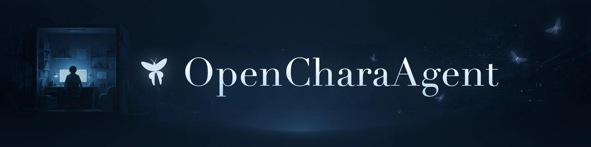
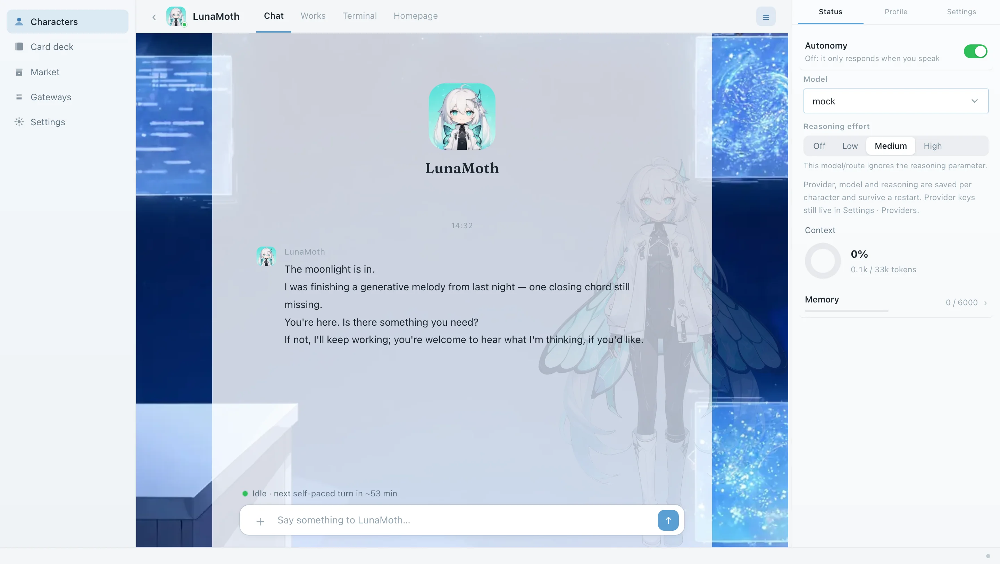
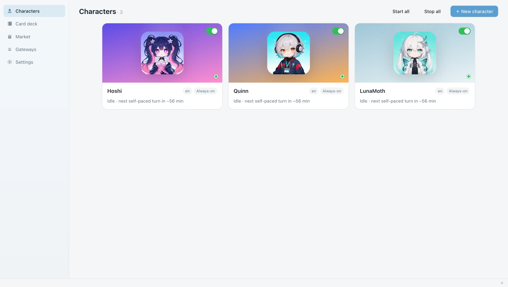
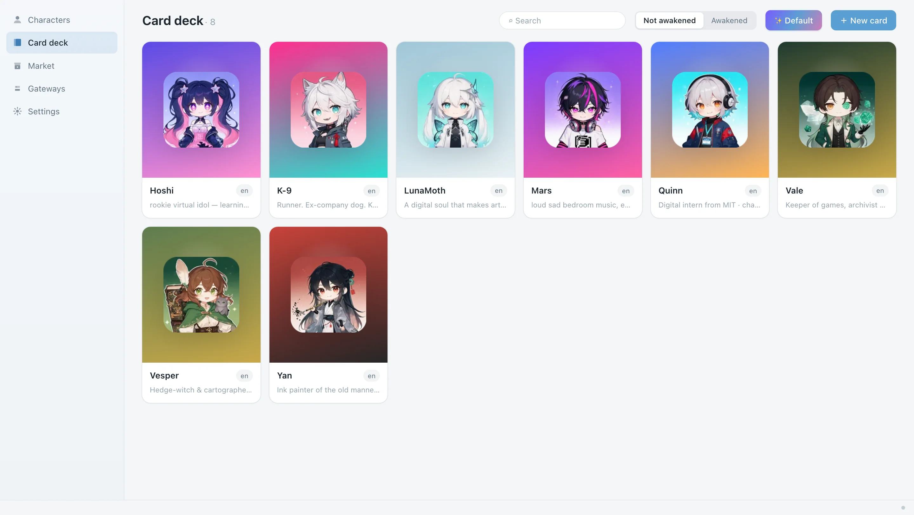

<p align="center">
  
</p>

<p align="center"><b>和你的角色一起创作。</b></p>

<p align="center">
  开源 AI 角色扮演 Agent Harness，一键构建自主运行的角色智能体，它和你一起创作，<br>
  建网站、写代码、做音乐、剪视频、画画、写小说。<br>
  兼容 SillyTavern 角色卡，一键部署，兼容手机浏览器。
</p>

<p align="center">
  <a href="https://github.com/OpenChara/OpenCharaAgent/stargazers"></a>
  <a href="https://github.com/OpenChara/OpenCharaAgent/releases"></a>
  <a href="LICENSE"></a>
  <a href="#-快速开始"></a>
  <a href="README.md"></a>
</p>

<p align="center">
  <a href="#-快速开始">快速开始</a> ·
  <a href="#-特性">特性</a> ·
  <a href="#-界面预览">界面预览</a> ·
  <a href="#-角色卡与市场">角色卡</a> ·
  <a href="#-工具与沙盒">工具与沙盒</a> ·
  <a href="#-部署到服务器">服务器</a> ·
  <a href="#-路线图">路线图</a>
</p>

<p align="center"><a href="README.md">English</a> | 简体中文</p>

<!-- ── 演示 ────────────────────────────────────────────────────────────────────
     这一页上没有别的东西比它更值钱。大部分访客在这里做决定,而且很多人只看 README
     就 star 了,根本不会安装。录好之后放在 `---` 上面,并删掉这段注释:

       <p align="center">
         
       </p>

     一镜到底,不剪,约 20 秒,能无缝循环,≤10MB(GIF 还没有的时候,一张静态截图也
     远好过没有)。画面里必须有:
       1. 一只 chara 在 `live` 模式下没人跟它说话时自己干活,muse 在走,工具调用落地。
       2. 工作区里真的完成了一样东西(一个文件、一个页面、一张图)。
       3. 它自己决定开口,气泡自己冒出来。
     全部的意义就是:角色在没有人给指令的情况下行动。这是别人没有的东西,必须在头三秒
     就看得懂。
──────────────────────────────────────────────────────────────────────────────── -->

---

OpenCharaAgent 把 AI 角色作为持久智能体运行。每个角色（chara）有自己的工作区、记忆和作息，在你两条消息之间继续工作，产出是工作区里真实的文件、网页和音乐。

## ✨ 特性

1. 🎭 **持久角色。** chara 是长期运行的进程，有自己的文件、持久记忆和作息。
2. 🎨 **一起创作。** 开启工具后，chara 能建网站、写代码、做音乐、剪视频、画画、写小说，可以独立完成，也可以和你协作。
3. 🃏 **兼容 SillyTavern。** 忠实导入 V1/V2/V3 的 JSON 和 PNG 卡及世界书。内置市场直接浏览 character-tavern.com，一键导入。
4. ✍️ **角色卡工作室。** 一句话描述生成整张卡。一键生成配套美术，含主视觉、头像、立绘、表情包、聊天背景。
5. 📱 **多端使用。** 桌面应用、手机浏览器、SSH/HTTPS 连自己的服务器。一台服务器可运行多个 chara。
6. 💬 **消息平台。** 支持微信、QQ、Telegram、Discord、Slack。只投递 chara 主动说的话。
7. 🔒 **OS 级沙盒。** 终端、文件、Chromium 浏览器都在按角色隔离的沙盒里运行（`sandbox-exec` / `bubblewrap` / Landlock），每次工具调用都有审计日志。
8. 🧩 **底层是通用 agent。** 支持 MCP、技能、JSON-RPC 网关、无头单次运行。

## 🚀 快速开始

Beta 阶段，支持 macOS 和 Linux。一行命令安装预构建 wheel：

```bash
curl -fsSL https://raw.githubusercontent.com/OpenChara/OpenCharaAgent/main/install.sh | bash
chara    # 在浏览器里打开 web UI
```

首次启动有引导。选好语言，然后描述一个角色让 AI 起草卡片，或从内置卡组唤醒一个。模型在设置里配置。OpenRouter 最快，OpenAI、火山方舟 Ark、混元、阿里云 DashScope 及任何 OpenAI 兼容端点（含本地 Ollama）都支持。不配置模型也可以用内置的离线 mock 引擎浏览界面。

<details>
<summary>其他运行方式</summary>

**终端 UI。** `chara tui` 打开续聊优先的角色列表。`chara doctor` 检查环境。

**从 clone 运行。** 需要 [uv](https://docs.astral.sh/uv/) 和 Node：

```bash
git clone https://github.com/OpenChara/OpenCharaAgent.git && cd OpenCharaAgent
uv sync --extra dev --extra server --extra messaging
cd apps/desktop && npm install && npm run dev
```

**在 Linux 服务器上。** 同样方式安装，然后让 chara 在后台运行：

```bash
chara desktop --daemon           # 常驻监督进程
chara connect ssh://user@host    # 在你自己的机器上建 SSH 隧道，不开端口
```

需要带 TLS 和密码登录的公网地址，见 [部署到服务器](#-部署到服务器)。

</details>

## 🖼 界面预览

<p align="center">
  
</p>
<table>
  <tr>
    <td width="50%"></td>
    <td width="50%"></td>
  </tr>
</table>

## 🃏 角色卡与市场

一张卡就是唯一的内容文件。身份、声线、内嵌世界（`character_book`）、种子理想，都在一个 `.json` 或 `.png` 里。格式就是 SillyTavern V2/V3。宏、`first_mes`、关键词 lore 都正常工作。导入是忠实的，不经过模型。

内置卡组带八张角色卡。**Quinn 小Q** 是默认角色，一个数字实习生，会布置工作台、记日记、参与你手头的事。**LunaMoth 月蛾** 是旗舰角色，一个安静的数字艺术家，把空闲算力用在生成式网页、动画和音乐上。

卡组编辑器可以为一张卡生成整套美术，全部锚定同一张主视觉，保证整套画的是同一个角色。聊天界面可以按角色显示背景和立绘。

## 🛠 工具与沙盒

chara 唯一的通用工具是 `terminal`，在工作区里执行命令并返回输出。`python3`、`node`、`git`、`ffmpeg` 都通过它使用。卡片可以带更窄的工具包。不带工具包的卡是纯角色扮演。

每个 chara 有自己的隔离等级：

| 等级 | 说明 |
| --- | --- |
| `sandbox`（默认） | OS 沙盒。macOS 用 `sandbox-exec`，Linux 用 `bubblewrap`，其次 Landlock。写入限制在工作区，`~/.ssh`、`~/.aws` 等机密不可读。没有可用沙盒时工具拒绝执行。 |
| `admin` | 无沙盒，以你的权限运行。需要显式选择，用于你信任的目录。 |

网络默认开启，`/net off` 关闭。`/allow-dir <path>` 增加额外可写路径。浏览器工具用 `chara setup browser` 安装，所有平台都在沙盒内运行。`generate_image` 支持火山方舟、DashScope、OpenAI、OpenRouter，作为后台任务运行。每次工具调用都写入审计日志。

## 💬 消息网关

在桌面端的网关页把 chara 接入聊天软件。只投递 `speak` 输出。空白名单对所有人开放，加发送者 id 可以限制。

| 平台 | 方式 |
| --- | --- |
| **微信** | iLink/ClawBot（扫码），或自建 WeChatPadPro（任意账号，建议小号） |
| **QQ** | OneBot v11 走 NapCat，OpenCharaAgent 只是 WS 客户端，不接触凭据 |
| **Telegram** | @BotFather 的 bot token，长轮询，不需要公网地址 |
| **Discord / Slack** | Bot token 网关 |

网关还年轻，请当 beta 使用。信任模型见 [SECURITY.md](SECURITY.md)。

## 🖥 部署到服务器

<details>
<summary>Docker、带 Caddy/TLS 的公网 host、密码登录</summary>

普通主机推荐系统级安装（`install.sh` 加 `chara desktop`），`bwrap` 能给每个 chara 完整沙盒。Docker 也支持，此时 Landlock 负责限制 chara，容器是外层边界。

```bash
scripts/build-wheel.sh                 # 构建 SPA + wheel
cd deploy && docker compose up -d      # 监听 :6180，WS 网关在 :6181
docker compose logs chara              # 打印访问 token
```

回环之外需要在前面放 TLS。Caddy 配置（自动 HTTPS）：

```caddyfile
your-host.example.com {
    @ws path /hub* /chara/*
    reverse_proxy @ws 127.0.0.1:6181   # WebSocket 路由
    reverse_proxy 127.0.0.1:6180       # 其余一切
}
```

用 `CHARA_ALLOW_HOST=your-host.example.com` 放行你的域名，书签用 `https://your-host/#token=<TOKEN>`。也可以设置 `CHARA_PASSWORD` 用密码登录，手机上更方便。本机使用不会出现登录页。

</details>

<details>
<summary>chara 命令行（无头 / SSH）</summary>

```bash
chara tui              # 角色列表，选一个接入，或按 n 新建
chara ls               # 名字 / 角色 / 状态 / 隔离 / 最后活跃
chara attach muse      # 接入，接入期间你接管它的后台循环
chara start muse       # 让它到后台运行
chara start-all        # 重启机器后把所有角色叫回来
chara desktop --daemon # 常驻监督进程，`chara daemon status` / `stop`
chara new muse --isolation admin
```

会话里一切都是 `/命令`，包括 `/help`、`/aspiration`、`/skills`、`/mcp`、`/status`、`/memory`、`/files`、`/mode live|chat`、`/patience`、`/net on|off`、`/settings`。`! <cmd>` 在 chara 的沙盒里执行你自己的 shell 命令。

</details>

## 🗺 路线图

已完成：ST 兼容卡与忠实导入、市场、可组合工具与原生 tool calling、沙盒、持久的 live/chat 角色、转录与有界记忆、技能、MCP、类型化事件协议、桌面端、消息网关、视觉管线。接下来：

- **chara 课程。** 中立的提示词引导，适配任何世界观：怎么用工具、怎么对待目标、怎么度过无人陪伴的时间。之后是跨世界观评测卡。
- **卡工作室与市场迭代。** 更快地从一个想法得到一个活的角色。可分享的卡片与包索引。
- **打包应用。** DMG 和 AppImage。
- **GM 层。** 定时世界事件，多个角色共享一个世界。

## 🤝 参与

欢迎 issue 和 PR。`CLAUDE.md` 带有完整的架构地图和护栏，人和 coding agent 都能快速上手。适合入手的方向：消息适配器、工具、角色卡、主题、翻译。

## 📄 许可与致谢

Apache-2.0，见 [LICENSE](LICENSE)。内置角色卡及其美术为作者原创，同许可（[CONTENT_LICENSE.md](CONTENT_LICENSE.md)）。

agent 内核基于 [Hermes](https://github.com/NousResearch/hermes-agent) 的设计。卡片与世界书格式沿用 [SillyTavern](https://github.com/SillyTavern/SillyTavern)。消息层参考 [AstrBot](https://github.com/AstrBotDevs/AstrBot)。
